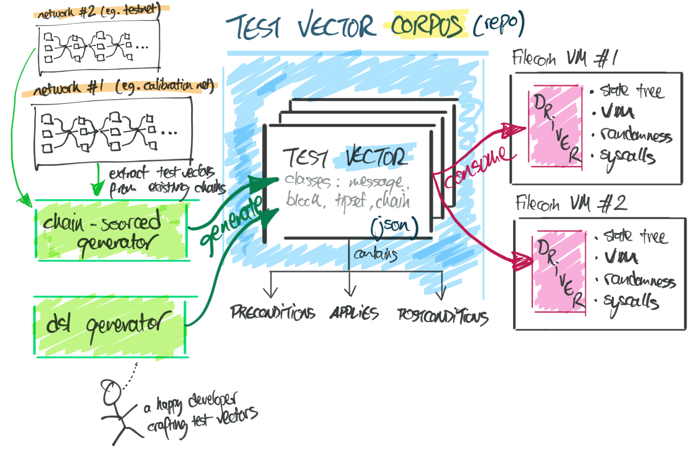

# VM and chain test vectors for Filecoin implementations

This repo contains a corpus of interoperable test vectors for Filecoin
implementations to test their correctness and compliance with the
[Filecoin specifications](https://beta.spec.filecoin.io/).



<!-- START doctoc generated TOC please keep comment here to allow auto update -->
<!-- DON'T EDIT THIS SECTION, INSTEAD RE-RUN doctoc TO UPDATE -->
**Contents**

- [About this repo](#about-this-repo)
- [Test vector specification (`corpus` directory)](#test-vector-specification-corpus-directory)
  - [Format and schema](#format-and-schema)
  - [Classes](#classes)
- [Test vector generation (`gen` directory)](#test-vector-generation-gen-directory)
  - [How are vectors generated?](#how-are-vectors-generated)
  - [Running the generation scripts](#running-the-generation-scripts)
- [Special test harness actor](#special-test-harness-actor)
- [Broken/incorrect vectors](#brokenincorrect-vectors)
- [Integration in Lotus](#integration-in-lotus)
- [Testing the conformance of a Filecoin implementation](#testing-the-conformance-of-a-filecoin-implementation)
  - [Message-class vectors test flow](#message-class-vectors-test-flow)
  - [Debugging state differences via statediff](#debugging-state-differences-via-statediff)
- [Got questions? Get in touch!](#got-questions-get-in-touch)
- [License](#license)

<!-- END doctoc generated TOC please keep comment here to allow auto update -->

## About this repo

The structure of this repo revolves heavily around **test vector suites**,
which are groups of test vectors that exercise a common set of functionalities,
or system surfaces.

The two top-level folders are:

 - `corpus`: contains the corpus of JSON test vectors.
 - `gen`: contains the generation material for test vectors.

```
 /
 |
 ├── corpus                 >>> test vector corpus.             
 |    ├── suite-a           >>> test vectors for suite suite-a. 
 |    |    ├── vector-1.json
 |    |    ├── vector-2.json
 |    |    ├── vector-3.json
 |    |    └── ...
 |    |
 |    ├── suite-b
 |    └── ...
 |
 ├── gen
 |    ├── builders          >>> Go test vector builder SDK.
 |    ├── extern            >>> external dependencies vendored in.
 |    └── suites            >>> Go generation scripts for each suite.
 |         ├── suite-a 
 |         ├── suite-b
 |         └── ...
 |
 ├── schema
 |    ├── schema.go         >>> Go type bindings for the JSON vectors.
 |    └── ...
 |
 └── schema.json            >>> JSON schema for the JSON encoded vectors in corpus/.
```

## Test vector specification ([`corpus`](./corpus) directory)

### Format and schema

For maximum interoperability, test vectors are represented in JSON, with binary
data encoded in base64. Some fields are gzipped prior to encoding (e.g. `car`).

Check out the [JSON schema](schema.json) for a full specification. 

<details>
  <summary>Here's an example for a message-class vector, for illustration purposes.</summary>
  
```json
{
  "class": "message",
  "_meta": {
    "id": "kebab-cased-vector-id",
    "version": "v1",
    "gen": [
      {
        "source": "github.com/filecoin-project/lotus",
        "version": "v0.4.3-0.20200815233716-a0c0d9c98aae"
      },
      {
        "source": "github.com/filecoin-project/lotus",
        "version": "v0.9.2"
      }
    ]
  },
  "car": "H4sIAAAAAAAA/0pflFqUn19S3HRDK0KdgbFwwRMmBfGLv1LVL3VerDo14dlH77kzV0Sv... (gzipped+b64 string)",
  "preconditions": {
    "epoch": 0,
    "state_tree": {
      "root_cid": {
          "/": "bafy2bzaceal5d6tfe7jitul2zkion4kltwm2qw5mhhtvq6kswfgvugbyaxyjy"
      }
    }
  },
  "apply_messages": [
    {
      "bytes": "igBCAAFCAGQARQA7msoAGjuaygBCAMhCAAECWB+C2CpTAAFVAA5maWwvMS9tdWx0aXNpZ0eDgUIAZAEA",
      "epoch": 1
    },
    {
      "bytes": "igBCAGVCAGQBQBo7msoAQgDIQgABAlCEQgACQgABAkeEQgBkQEAA",
      "epoch": 1
    }
  ],
  "postconditions": {
    "state_tree": {
      "root_cid": {
        "/": "bafy2bzacec4wwiuetz6niqddrf6wvnrw7mulh7qetasu5baawlmsektudu3lm"
      }
    },
    "receipts": [
      {
        "exit_code": 0,
        "return": "gkIAZVUCulfg8vZ/7J5CXG2GyhSNyctOIzA=",
        "gas_used": 2116793
      },
      {
        "exit_code": 0,
        "return": "hAD1CEA=",
        "gas_used": 1372947
      }
    ]
  }
}
```
</details>

### Classes

> ✅ = supported // 🚧 = in progress

There are 4 kinds of test vector classes:

 1. ✅  message-class vectors.
 2. 🚧  tipset-class vectors.
 3. 🚧  chain-class vectors.
 4. 🚧  blockseq-class vectors.

Every test vector specifies its class in the top-level `class` field (compulsory).

**Message class**

Tests one, or many, messages being applied on top of a precondition state tree,
providing the expected postcondition state root, and the execution receipt for
each message.

**Tipset class**

> ⚠️  In discussion; may conflate with chain-class.

Tests a tipset containing multiple blocks with messages, applied on top of a
precondition state tree, and a precondition chain history. Postconditions TBD,
but will include miner rewards.

**Chain class**

> ⚠️  In discussion; may conflate with tipset-class.

Tests a series of tipsets applied on top of a precondition state tree, and a
precondition chain history. Postconditions TBD.

**Block sequence class**

Tests a sequence of blocks arriving from the network at specific timestamps,
on top of a precondition state tree, and a precondition chain history.
Useful for verifying chain reorgs and forks. Postconditions TBD.

## Test vector generation ([`gen`](./gen) directory)

Alongside the corpus, you will find a `gen` directory holding the material used
to instantiate the corpus. This includes:

 1. the Go builder SDK.
 2. the generation scripts written in Go.
 
We find that colocating the vectors with the generation material makes things
traceable, comprehensible, and debuggable.

### How are vectors generated?

Currently, all vectors are generated from [Lotus](https://github.com/filecoin-project/lotus)
and [specs-actors](https://github.com/filecoin-project/specs-actors) **(reference
implementations of the Filecoin protocol)**.

In the future, vectors may be generated from:
 
 - alternative implementations; e.g. by allowing the builder SDK to be backed
   by any implementation —or—
 - extracted from existing chains; [Project Oni](https://github.com/filecoin-project/oni)
   is incubating tooling for that.

To facilitate tracing and debugging, vectors are stamped with the generation
source under the `_meta.gen` field.

### Running the generation scripts

Each suite is actually a standalone program that generates all of its
test vectors. Try it out!

```shell script
# make sure to run from the gen directory, so Go can pick up the module file.
$ cd gen

# running the suite with no flags will output vectors to stdout, one per line.
$ go run ./suites/msg_application

# running with -o writes vectors to the specified directory.
# this command will write the msg_application vectors to the corpus directory.
$ go run ./suites/msg_application -o ../corpus/msg_application

# running with -u will update any existing vectors in the specified directory
# IF their content has changed. Note `_meta` is ignored when checking equality.
$ go run ./suites/msg_application -u -o ../corpus/msg_application

# running with -f will force regeneration, overwriting any existing vectors in
# the specified directory.
$ go run ./suites/msg_application -f -o ../corpus/msg_application

# you can filter vectors to include with a regex that is matched against the id.
# this command will generate vectors whose id contains the string 'invalid'.
$ go run ./suites/msg_application -i '.*invalid.*'
```

There is also handy makefile targets to generate them all:

```shell
# Generate all test vectors and write them to ./corpus, do not touch existing
# vectors, only create new ones.
$ make gen

# Generate all test vectors, updating existing vectors IF they have changed.
# (this is probably what you want 99% of the time)
$ make upgen

# Re-generate all test vectors, overwriting existing vectors.
$ make regen
```

## Special test harness actor

> 💡 Remember that an Actor in Filecoin is the equivalent of a "smart contract"
> in other blockchains. Currently, Filecoin does not support user-programmable
> actors. The system relies on a series of builtin system actors, some of which
> are prototype actors that can be instantiated multiple times by user account
> actors, like payment channel actors and multisig actors. Others are singleton
> actors that are instantiated once at genesis, and are assigned fixed addresses
> in a reserved range (e.g. system actor, init actor, reward actor, etc.)

In order to test VM correctness, some vectors exercise situations that should
not be seen in properly implemented actor code. To induce those situations,
those vectors rely on a special test harness actor that sits "on the inside"
and triggers those situations when specific messages are sent to it.

The **Chaos Actor (address `t98`)** exercises behaviours that should be
regarded as illegal by the VM. Its ABI spec is part of this testing spec, and
it's currently being heavily developed.

* Test vectors requiring the **Chaos Actor** carry the `chaos_actor:true`
  selector.
* Refer to the implementation under the [`chaos` package](./chaos).
* Once stable, we will document this actor in a spec.
   
To benefit from maximum testing coverage, implementations should implement this
actor and make their test drivers deploy them in the test VM. The Chaos actor
should only be deployed when the cited selector is present.

## Broken/incorrect vectors

All vectors in this repo are generated by Lotus; either through the DSL, or by
cherry-picking events from live chains. In some cases, there are mismatches
between the expected behaviour and the actual behaviour of Lotus itself, thus
leading to what we call _broken/incorrect vectors_: vectors that are known to
cause incorrect behaviour in the reference implementation.

We check them in anyway, and we identify them explicitly in this manner:

1. Their JSON files are prefixed with `x--` (intended for easy
   browsing/identification by humans).
2. The JSON itself contains the value `incorrect` in the `hints` field
   (intended for machine-parsing).

You can choose to ignore these vectors entirely, or you can explicitly negate
the postcondition checks. Vectors that are "negateable" also carry the `negate`
hint. For these, you could invert the postcondition check such that you verify
that the actual final state **DOES NOT MATCH** the vector's postcondition,
skipping/passing in that case, and failing if it DOES match.

Admittedly it is bizarre to check knowingly-broken test vectors into a repo like
this, but it is useful in our path towards 100% correctness of Lotus.

## Integration in Lotus

The `conformance` package of Lotus contains two components:

 1. a **[test driver](https://github.com/filecoin-project/lotus/blob/conformance-tests/conformance/driver.go)**
    that exercises Lotus against interoperable JSON-based test vectors.
 2. a **[test runner](https://github.com/filecoin-project/lotus/blob/conformance-tests/conformance/runner_test.go)**,
    which is essentially a go test that feeds the test vector corpus hosted here
    to the **test driver**, spawning a new subtest for each vector.

Those components were introduced in [PR #3081](https://github.com/filecoin-project/lotus/pull/3081),
along with [a CI job](https://github.com/filecoin-project/lotus/pull/3081/files#diff-1d37e48f9ceff6d8030570cd36286a61)
that runs the conformance suite on every commit.

This setup currently supports message-class vectors, and it targets the
[Filecoin VM](https://beta.spec.filecoin.io/#intro__filecoin_vm) directly.

## Testing the conformance of a Filecoin implementation

So you've implemented the Filecoin protocol, and you want to test the compliance
of your VM and blockchain components against the spec, and their interoperability
with other clients? You're in the right place! Here are some notes on how to
get started ⚡️

First, you will need to parse the test vector JSON. In go, we use the
`encoding/json` package with [this set of structs](https://github.com/filecoin-project/lotus/pull/3081/files#diff-76ab977c5dcf2fa0ccbd1d4eb0387f1f).

Depending on the test vector class, your logic will vary.

### Message-class vectors test flow

You will need a way to load a CAR from a stream of bytes that is encoded in
base64, into your IPLD `Blockstore`. If you're working with Filecoin and IPLD,
you have probably already figured this out, but check the Lotus driver to see
how we do it for reference.

Next, you will need to load the **precondition state tree** from the
`Blockstore`, using the **precondition state root CID** provided in the test
vector.

Then you instantiate your VM, supplying that state tree. You are now ready to
apply each message.

For each message, you will want to verify that the receipt matches the receipt
at the same position in the `postconditions.receipts` array.

After you apply all messages, you will want to obtain the root of the resulting
state tree from your VM, and compare against `postconditions.state_tree.root_cid`.

If the comparisons succeed, the test vector succeeds. Otherwise, you will want
to debug what's wrong. If the mismatch is on a receipt, you have a good lead.
But if the mismatch is on the state root, hunting it down can be tricky.
Continue reading.  

### Debugging state differences via statediff

> 🚧  This is work in progress.

The Oni team is developing a tool that performs a recursive, spidering, semantic
state tree HAMT comparison.

This tool is capable of decoding diving into the state of each actor, and
decoding all data structures into high-level structs on which field-level
comparisons can be performed to produce a diff-like output.

This tool is being developed in the [Oni repo](https://github.com/filecoin-project/oni/),
and you can track [PR #201](https://github.com/filecoin-project/oni/pull/201)
for progress updates.

It supports two modes of input:

 1. Providing CAR files and root CIDs for sides left and right of the comparison.
 2. Providing an RPC endpoint and two tipsets for left and right sides.

Both methods are designed to operate with any Filecoin implementation.

This tool can be invoked as a library from Go programs, or as an executable
from non-Go programs (such as your Rust, C++, Clojure, Haskell... driver) or CLI. 

## Got questions? Get in touch!

This work is in early stages of development. We're eager to hear your feedback,
input, and ideas!

* [@raulk](https://github.com/raulk)
* [@nonsense](https://github.com/nonsense)
* [@willscott](https://github.com/willscott)
* [@alanshaw](https://github.com/alanshaw)

## License

Dual-licensed under [MIT](https://github.com/filecoin-project/test-vectors/blob/master/LICENSE-MIT) + [Apache 2.0](https://github.com/filecoin-project/test-vectors/blob/master/LICENSE-APACHE)

